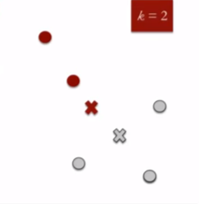
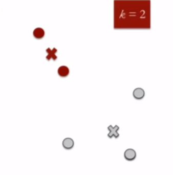

# What is it?

k-means clustering is an unsupervised machine learning algorithm. It takes an unknown input and produces an unknown output.

This method of clustering is a centraid model meaning that the similarity between data points is defined by their closeness to a central cluster point.

# How Does it work?

We start by defining the desired number of clusters (k), then randomly placing the centroids in the data. The distance from centroids to each data point is calculated and each point is clustered to its closest centroid. 

New centroids are then defined by taking the means of each point in the cluster. The process is iterative, and should repeat until convergence, or in other words, until no improvements to the clusters are possible.

[Images from Analytics Vidhya](https://www.analyticsvidhya.com/blog/2016/11/an-introduction-to-clustering-and-different-methods-of-clustering/)

# Strengths:

- Easy to implement, understand and interpret results
- Suitable for large datasets, fast and efficient

# Weaknesses:

- Defining k values manually can be difficult
- Output can vary on different runs due to random starting points
- Sensitive to outliers
- Becomes less useful as more dimensions are introduced

# Example use case:

One guy used k-means clustering together with PCA to classify strikers in the Scottish Professional Football League, with the theory that clubs can simplify deals during transfer season by using data:

https://www.modernfitba.com/blogs/2021/4/7/classifying-strikers-in-the-spfl-with-primary-component-analysis-and-k-means-clustering

Honourable mention: doesn’t use k-means but really cool cluster analysis of patterns in build-up play of Premier League teams, with a shiny app!

https://www.statsperform.com/resource/identifying-patterns-in-build-up-play-using-clustering/